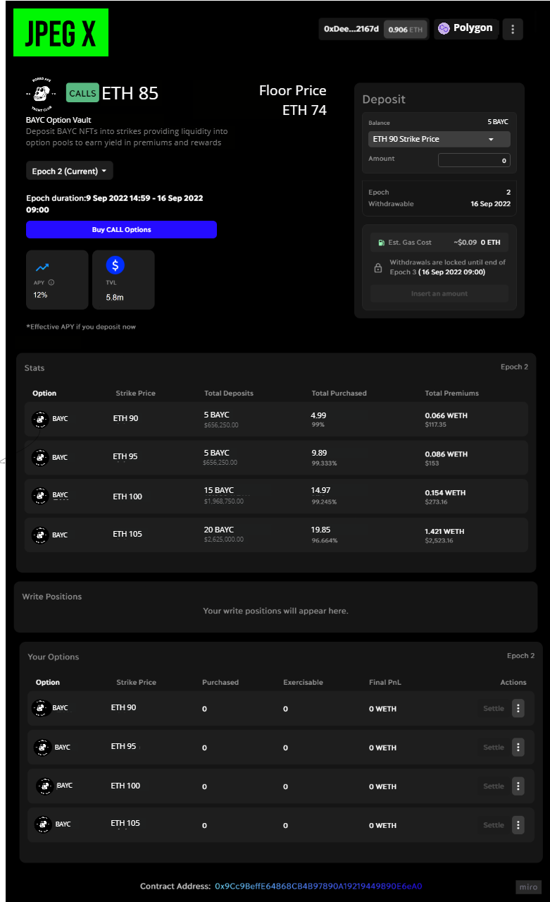

<h1 align="center">
  JPEG X
</h1>

  

  <strong>
    Decentralized NFT Options
  </strong>

  Just as in traditional art market ...  ... the financialization of NFTs is inevitable

  
  
  

<!-- [**👉 Our Glorious Deployment URL 👈**](https://conveyr.xyz/) -->

## Table of Contents

- [In a nutshell](#in-a-nutshell)
- [Concept](#concept)
- [Product](#product)
- [Technical Implementation](#technical-implementation)
- [Business Potential](#business-potential)
- [License](#license)
- [Thanks](#thanks)

## In a nutshell

- NFT holders are not incentivized enough to become option writers, despite the financial upside
- Our goal is to attract NFT holders to become option writers and bootstrap the NFT options economy

## Concept

- NFT owners can 'write options' on their NFTs
- Option callers can purchase the options, at a given strike price, for a given premium and time
- JPEG X options are **european**, **cash settled**
- If the option expires _in-the-money_, the sequence goes as follows:
  - The NFT holder can provide the strike vs. market price difference to option caller, or
  - Option caller can receive the NFT at option's strike price, or
  - NFT is auctioned off
- If the option doesn't expire _in-the-money_, option premiums are distributed to NFT owners
- NFT owners are incentivized to gain passive income and provide liquidity
  - NFT is returned to owner, even if the option goes against them
  - Option coverage solution is created to protect the owners from large lump sum expense, at expiry

## Product

- Protocol defines strike price and premium pricing options
- Protocol stakes the NFT for the option duration
  - NFTs are pooled with other NFTs OF THE SAME COLLECTION
  - At staking time, the NFT owner has the option to subscribe to option cover stream
    - The option cover stream continously balances the strike to market price differential for the owner
    - Ensuring the NFT owner doesn't loose the NFT or has to pay large lump sum, on _in-the-money_ option expiry
    - Incentivizing NFT owner to provide their NFTs, improve liquidity and realize financial upside
    - Otherwise NFT owner might need to pay lump sum price differential between strike and market price, to keep NFT
- Protocol will automatically distribute the share of option premiums to NFT owners in the collection
  - Distributions will happen when the option doesn't expire _in-the-money_

## Technical Implementation

- Smart Contract defines option details per NFT Collection and stakes NFTs
  - Strike Price
  - Premium Price
  - Duration
    - Pricing Oracles will be used to establish Strike Price
    - Bonding curves will define strike to premium price for multiple options
- Martket price will be retrieved by Oracles
- Bonding curves will be used to define premiums
- Smart Contract governs the option expiry and distribution of profit shares to writers or of strike:market price differential to callers
- To distribute the shares of NFT pool's premiums to NFT owners, <a href="https://docs.superfluid.finance/superfluid/developers/interactive-tutorials/instant-distribution">Superfluid IDA</a> is used
  - Ensures gas efficient distribuition of pool shares to multiple addresses
- To create an ongoing option coverage to NFT owner, <a href="https://docs.superfluid.finance/superfluid/developers/constant-flow-agreement-cfa">Superfluid CFA</a> is used
  - Provides ongoing balancing of strike to market price differential for option writers, in a sigle transaction.
  - Keeper will be used for ongoing stream monitoring and flow rate adjustments within the epoch

### The flow:

## Business Potential

- Notional value of single stock options was over 10% higher than spot in 2021
- This trend shows no sign of slowing crypto option platforms, such as LRA Opix and Z are growing
- We see the same happening for NFTs, despite the bear 🧸, the top 10 NFT collections
  - Total over 2.5 million E in market cap
  - Over 3 million in daily trading on OPC alone
  - No team has succeeded yet in finding product market fit and gaining any significant traction.
- The financialization of NFTs is inevitable

## 🧐 License

Licensed under the [MIT License](./LICENSE).

## 💜 Thanks

Thanks go out to all of the many sponsors and [ETHOnline](https://ethglobal.com/events/ethonline2022/home)
